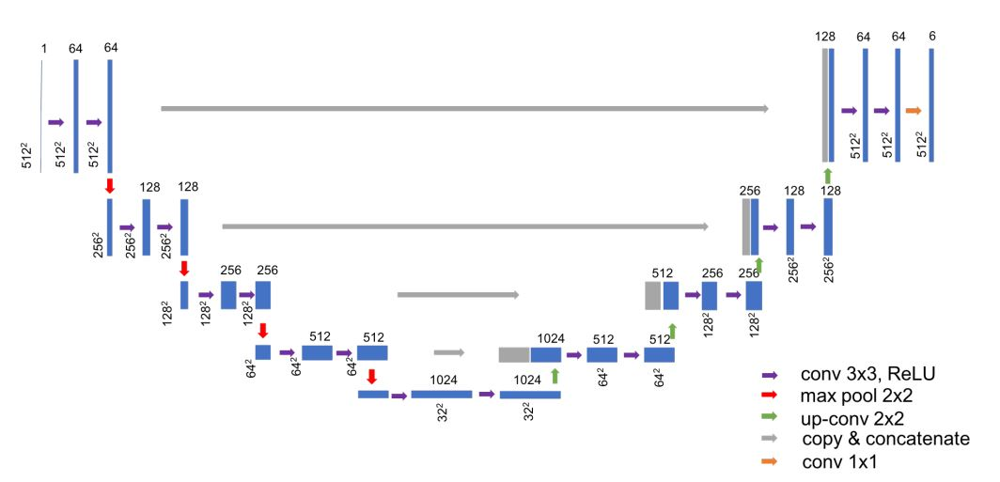
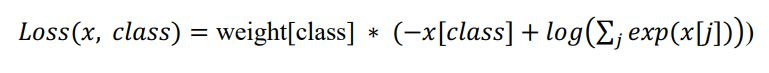

The neural network architecture was inspired by [U-Net: Convolutional Networks for Biomedical Image Segmentation](http://lmb.informatik.uni-freiburg.de/people/ronneber/u-net/) and based on the previous work [Convolutional neural networks for automated annotation of cellular cryo-electron tomograms](https://www.nature.com/articles/nmeth.4405)

---

### Model

Loss function:

---

## How to use
1. Prepare pre-processed data and label as described.
2. Use main.py for trainning and testing.
3. Use predict.py on new dataset.

### Dependencies

- [Pytorch](https://pytorch.org/)
